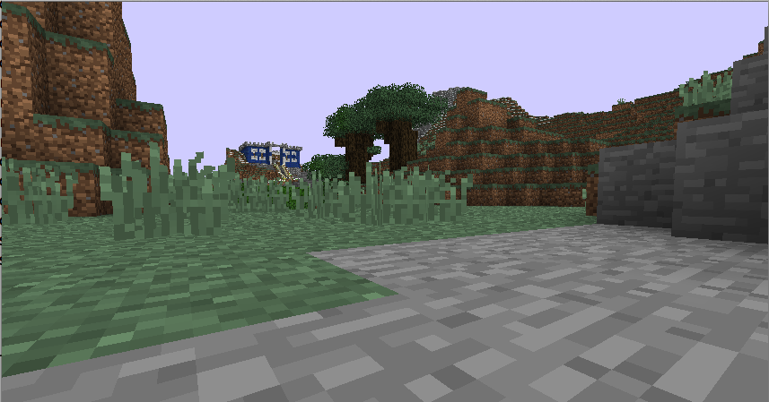
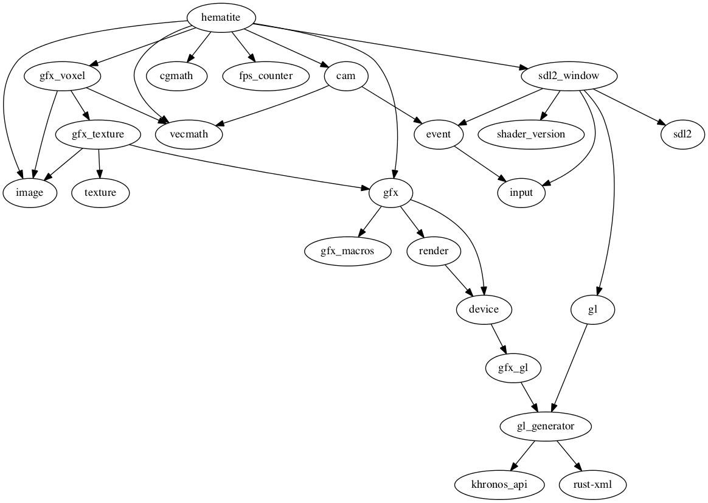

# hematite 

A simple Minecraft written in Rust with the Piston game engine

## Getting Started
### Windows

* Download SDL2 binaries from <https://www.libsdl.org/download-2.0.php>
* Copy SDL2.dll to `C:\Rust\bin\rustlib\x86_64-pc-windows-gnu\lib`, also in Hematite's root folder.

### OS X

* If you have brew installed you can `$ brew install sdl2`

### Linux

* Ubuntu users can use `$ sudo apt-get install libsdl2-dev`

* Otherwise install sdl2 with your distro's package manager

Should get you going without problems, if you find any issues please file them.

## How To Open a World

*This method is only for personal use. Never distribute copyrighted content from Minecraft.*

* In the Minecraft Launcher, click the button "New Profile"
* In the drop down "use version", select `1.8.3`
* Click "Save Profile"
* Click "Play" (this will download the snapshot)
* Quit Minecraft

* **Copy** your world save to to the hematite directory (It may corrupt your world)
* Save Locations:
  * **Windows:** `%appdata%\minecraft\saves\`
  * **OSX:** `~/Library/Application Support/minecraft/saves/`
  * **Linux/Other:** `~/.minecraft/saves/`
* Run hematite with: `cargo run --release "./<WORLD_NAME>"`

## Dependencies

[How to contribute](https://github.com/PistonDevelopers/piston/blob/master/CONTRIBUTING.md)
